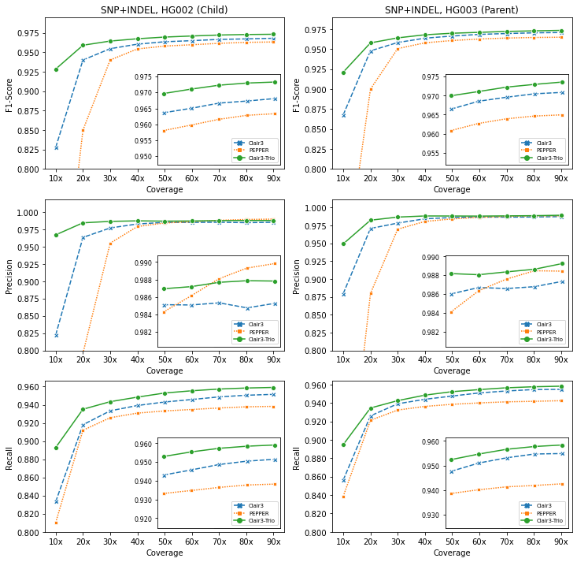

# Clair3-Trio: variant calling in trio using Nanopore long-reads


[](https://opensource.org/licenses/BSD-3-Clause)  

Contact: Ruibang Luo, Junhao Su  
Email: rbluo@cs.hku.hk, jhsu@cs.hku.hk  

----

## Introduction

Accurate identification of genetic variants from family child-mother-father trio sequencing data is important in genomics. However, state-of-the-art approaches treat variant calling from trios as three independent tasks, which limits their calling accuracy for Nanopore long-read sequencing data. For better trio variant calling, we introduce Clair3-Trio, the first variant caller tailored for family trio data from Nanopore long-reads. Clair3-Trio employs a Trio-to-Trio deep neural network model, which allows it to input the trio sequencing information and output all of the trio’s predicted variants within a single model to improve variant calling. We also present MCVLoss, a novel loss function tailor-made for variant calling in trios, leveraging the explicit encoding of the Mendelian inheritance. Clair3-Trio showed comprehensive improvement in experiments. It predicted far fewer Mendelian inheritance violation variations than current state-of-the-art methods. 

A preprint of Clair3-Trio is available in [bioRxiv](https://www.biorxiv.org/content/10.1101/2022.05.03.490460v1).

----

## Contents

* [Introduction](#introduction)
* [Latest Updates](#latest-updates)
* [What's New in Clair3-Trio](#whats-new-in-clair3-trio)
* [Pre-trained Models](#pre-trained-models)
  + [Guppy 5,6](docs/trio/guppy5.md)
  + [Guppy 4](#pre-trained-models)
* [Quick Demo](docs/trio/trio_quick_demo.md)
* [Installation](#installation)
  + [Option 1. Docker pre-built image](#option-1-docker-pre-built-image)
  + [Option 2. Build an anaconda virtual environment](#option-2-build-an-anaconda-virtual-environment)
  + [Option 3. Bioconda](#option-3-bioconda)
  + [Option 4. Docker Dockerfile](#option-4-docker-dockerfile)
* [Usage](#usage)
* [Folder Structure and Submodule Descriptions](#folder-structure-and-submodule-descriptions)
* [Training Data](docs/trio/training_data.md)
* [Clair3-Trio Model Training](docs/trio/trio_training.md)
* [Analysis Results](http://www.bio8.cs.hku.hk/clair3_trio/analysis_result/)

----

## Latest Updates

*v0.2 (May 15, 2022)*:  A guppy5 model for Clair3-Trio is available now. Check [this page](https://github.com/HKU-BAL/Clair3-Trio/blob/trio/docs/trio/guppy5.md) for more information about the Guppy5 model.

*v0.1 (April 22, 2022)*: Initial release.

---

## What's New in Clair3-Trio

* **New Architecture.** Clair3-Trio employs a Trio-to-Trio deep neural network model that allows it to take three samples as input and output the varaints of all three samples in one go.
* **Mendelian violations aware.**  Clair3-Trio uses MCVLoss to improve variants calling in trio by penalizing mendelian violoations. 
* **Improved Performance.** Using only 10x of HG002, 3 and 4 ONT data, Clair3-Trio achieved 97.30% SNP F1-score and 56.48% Indel F1-score. Compared to Clair3, Clair3-Trio reduced SNP errors by **~78%**,  and Indel errors by **~22%**. Clair3-Trio signficantly reduced Mendelian violations from 48,345 to 7,072.

<!--  -->

----

## Pre-trained Models

Download models from [here](http://www.bio8.cs.hku.hk/clair3_trio/clair3_trio_models/) or click on the links below.

|           Model name           |  Platform   |    Training samples         |   Date   |  Basecaller  | File    |          Link            |
| :----------------------------: | :---------: | :----------------------------------------------------------: | -------------------------------- | :--------------------------: | ----------------| :-------------------: |
|    c3t_hg002_r941_prom_sup_g5014 |     ONT     |                         HG002,3,4      |             20220514 | Guppy5 sup | c3t_hg002_r941_prom_sup_g5014.tar.gz      | [Download](http://www.bio8.cs.hku.hk/clair3_trio/clair3_trio_models/c3t_hg002_r941_prom_sup_g5014.tar.gz) |
|    c3t_hg002_g422 |     ONT     |                         HG002,3,4      |             20220422 | Guppy4 hac | c3t_hg002_g422.tar.gz      | [Download](http://www.bio8.cs.hku.hk/clair3_trio/clair3_trio_models/c3t_hg002_g422.tar.gz) |


### Clair3's Pre-trained Models

When using the Clair3-Trio model, please use a corresponding Clair3 model for Pileup calling. Check [here](https://github.com/HKU-BAL/Clair3#pre-trained-models) for more information about Clair3 pretrained model.

|           Model name           |  Platform   |                       Training samples                       | Date   |  Basecaller  | File                                |                             Link                             |
| :----------------------------: | :---------: | :----------------------------------------------------------: | -------------------------------- | :--------------------------: | ----------------------------------- | :----------------------------------------------------------: |
|      r941_prom_sup_g5014       |     ONT     |                    HG002,4,5 (Guppy5_sup)                    | 20220112 |  Guppy5 sup  | r941_prom_sup_g5014.tar.gz          | [Download](http://www.bio8.cs.hku.hk/clair3/clair3_models/r941_prom_sup_g5014.tar.gz) |
|    r941_prom_hac_g360+g422     |     ONT     |                         HG001,2,4,5                          | 20210517 | Guppy3,4 hac | r941_prom_hac_g360+g422.tar.gz      | [Download](http://www.bio8.cs.hku.hk/clair3/clair3_models/r941_prom_hac_g360+g422.tar.gz) |


----

## Quick Demo

*   see [Trio Quick Demo](docs/trio/trio_quick_demo.md).

----

## Installation

### Option 1. Docker pre-built image

A pre-built docker image is available [here](https://hub.docker.com/r/hkubal/clair3-trio). With it you can run Clair3-Trio using a single command.

Caution: Absolute path is needed for both `INPUT_DIR` and `OUTPUT_DIR`.

```bash
INPUT_DIR="[YOUR_INPUT_FOLDER]"            # e.g. /input
REF=${_INPUT_DIR}/ref.fa                   # change your reference file name here
OUTPUT_DIR="[YOUR_OUTPUT_FOLDER]"          # e.g. /output
THREADS="[MAXIMUM_THREADS]"                # e.g. 8
MODEL_C3="[Clair3 MODEL NAME]"         	   # e.g. Clair3 model, r941_prom_hac_g360+g422 for Guppy4 data, r941_prom_sup_g5014 for Guppy5 data
MODEL_C3T="[Clair3-Trio MODEL NAME]"       # e.g. Clair3-Trio model, c3t_hg002_g422 for Guppy4 data, c3t_hg002_r941_prom_sup_g5014 for Guppy5 data


docker run -it \
  -v ${INPUT_DIR}:${INPUT_DIR} \
  -v ${OUTPUT_DIR}:${OUTPUT_DIR} \
  hkubal/clair3-trio:latest \
  /opt/bin/run_clair3_trio.sh \
  --ref_fn=${INPUT_DIR}/ref.fa \                  ## change your reference file name here
  --bam_fn_c=${INPUT_DIR}/child_input.bam \       ## change your child's bam file name here 
  --bam_fn_p1=${INPUT_DIR}/parent1_input.bam \    ## change your parnet-1's bam file name here     
  --bam_fn_p2=${INPUT_DIR}/parenet2_input.bam \   ## change your parnet-2's bam file name here   
  --sample_name_c=${SAMPLE_C} \                   ## change your child's name here
  --sample_name_p1=${SAMPLE_P1} \                 ## change your parnet-1's name here
  --sample_name_p2=${SAMPLE_P2} \                 ## change your parent-2's name here
  --threads=${THREADS} \                          ## maximum threads to be used
  --model_path_clair3="/opt/models/clair3_models/${MODEL_C3}" \
  --model_path_clair3_trio="/opt/models/clair3_trio_models/${MODEL_C3T}" \
  --output=${OUTPUT_DIR}                          ## absolute output path prefix 

```

### Option 2. Build an anaconda virtual environment

**Anaconda install**:

Please install anaconda using the official [guide](https://docs.anaconda.com/anaconda/install) or using the commands below:

```bash
wget https://repo.anaconda.com/miniconda/Miniconda3-latest-Linux-x86_64.sh
chmod +x ./Miniconda3-latest-Linux-x86_64.sh 
./Miniconda3-latest-Linux-x86_64.sh
```

**Install Clair3 env and Clair3-Trio using anaconda step by step:**


```bash
# create and activate an environment named clair3
conda create -n clair3 python=3.6.10 -y
source activate clair3

# install pypy and packages in the environemnt
conda install -c conda-forge pypy3.6 -y
pypy3 -m ensurepip
pypy3 -m pip install mpmath==1.2.1

# install python packages in environment
pip3 install tensorflow==2.2.0
pip3 install tensorflow-addons==0.11.2 tables==3.6.1
conda install -c anaconda pigz==2.4 -y
conda install -c conda-forge parallel=20191122 zstd=1.4.4 -y
conda install -c conda-forge -c bioconda samtools=1.10 -y
conda install -c conda-forge -c bioconda whatshap=1.0 -y

# clone Clair3-Trio
git clone https://github.com/HKU-BAL/Clair3-Trio.git
cd Clair3-Trio

# download Clair3's pre-trained models
mkdir -p models/clair3_models
wget http://www.bio8.cs.hku.hk/clair3/clair3_models/clair3_models.tar.gz 
tar -zxvf clair3_models.tar.gz -C ./models/clair3_models


# download Clair3-Trio's pre-trained models
mkdir -p models/clair3_trio_models
wget http://www.bio8.cs.hku.hk/clair3_trio/clair3_trio_models/clair3_trio_models.tar.gz 
tar -zxvf clair3_trio_models.tar.gz -C ./models/clair3_trio_models


# run clair3-trio
_INPUT_DIR="[YOUR_INPUT_FOLDER]"            # e.g. ./input
_BAM_C=${_INPUT_DIR}/input_child.bam        # chnage your child's bam file name here
_BAM_P1=${_INPUT_DIR}/input_parent1.bam     # chnage your parenet1's bam file name here
_BAM_P2=${_INPUT_DIR}/input_parent2.bam     # chnage your parenet2's bam file name here
_SAMPLE_C="[Child sample ID]"               # child sample ID, e.g. HG002
_SAMPLE_P1="[Parent1 sample ID]"            # parent1 sample ID, e.g. HG003
_SAMPLE_P2="[Parent2 sample ID]"            # parent2 sample ID, e.g. HG004
_REF=${_INPUT_DIR}/ref.fa                   # change your reference file name here
_OUTPUT_DIR="[YOUR_OUTPUT_FOLDER]"          # e.g. ./output
_THREADS="[MAXIMUM_THREADS]"                # e.g. 8
_MODEL_DIR_C3="[Clair3 MODEL NAME]"         # e.g. ./models/clair3_models/ont
_MODEL_DIR_C3T="[Clair3-Trio MODEL NAME]"   # e.g. ./models/clair3_trio_models/c3t_hg002_g422

./run_clair3_trio.sh \
  --bam_fn_c=${_BAM_C} \    
  --bam_fn_p1=${_BAM_P1} \
  --bam_fn_p2=${_BAM_P2} \
  --output=${_OUTPUT_DIR} \
  --ref_fn=${_REF} \
  --threads=${_THREADS} \
  --model_path_clair3="${_MODEL_DIR_C3}" \
  --model_path_clair3_trio="${_MODEL_DIR_C3T}" \
  --sample_name_c=${_SAMPLE_C} \
  --sample_name_p1=${_SAMPLE_P1} \
  --sample_name_p2=${_SAMPLE_P2}

```
### Option 3. Bioconda


```bash
# make sure channels are added in conda
conda config --add channels defaults
conda config --add channels bioconda
conda config --add channels conda-forge

# create conda environment named "clair3-trio"
conda create -n clair3-trio -c bioconda clair3-trio python=3.6.10 -y
conda activate clair3-trio

# run clair3-trio like this afterward
_INPUT_DIR="[YOUR_INPUT_FOLDER]"            # e.g. ./input
_BAM_C=${_INPUT_DIR}/input_child.bam        # chnage your child's bam file name here
_BAM_P1=${_INPUT_DIR}/input_parent1.bam     # chnage your parenet1's bam file name here
_BAM_P2=${_INPUT_DIR}/input_parent2.bam     # chnage your parenet2's bam file name here
_SAMPLE_C="[Child sample ID]"               # child sample ID, e.g. HG002
_SAMPLE_P1="[Parent1 sample ID]"            # parent1 sample ID, e.g. HG003
_SAMPLE_P2="[Parent2 sample ID]"            # parent2 sample ID, e.g. HG004
_REF=${_INPUT_DIR}/ref.fa                   # change your reference file name here
_OUTPUT_DIR="[YOUR_OUTPUT_FOLDER]"          # e.g. ./output
_THREADS="[MAXIMUM_THREADS]"                # e.g. 8
_MODEL_DIR_C3="[Clair3 MODEL NAME]"         # e.g. r941_prom_sup_g5014
_MODEL_DIR_C3T="[Clair3-Trio MODEL NAME]"   # e.g. c3t_hg002_r941_prom_sup_g5014

run_clair3_trio.sh \
  --bam_fn_c=${_BAM_C} \    
  --bam_fn_p1=${_BAM_P1} \
  --bam_fn_p2=${_BAM_P2} \
  --output=${_OUTPUT_DIR} \
  --ref_fn=${_REF} \
  --threads=${_THREADS} \
  --model_path_clair3="${CONDA_PREFIX}/bin/models/${_MODEL_DIR_C3}" \ 
  --model_path_clair3_trio="${CONDA_PREFIX}/bin/models/${_MODEL_DIR_C3T}" \ 
  --sample_name_c=${_SAMPLE_C} \
  --sample_name_p1=${_SAMPLE_P1} \
  --sample_name_p2=${_SAMPLE_P2}
```

Check [Usage](#Usage) for more options. [Pre-trained models](#pre-trained-models) are already included in the bioconda package.


### Option 4. Docker Dockerfile

Building a docker image.
```
# clone Clair3-Trio
git clone https://github.com/hku-bal/Clair3-Trio.git
cd Clair3-Trio

# build a docker image named hkubal/clair3-trio:latest
# might require docker authentication to build docker image 
docker build -f ./Dockerfile -t hkubal/clair3-trio:latest .

# run clair3-trio docker image like 
docker run -it hkubal/clair3-trio:latest /opt/bin/run_clair3_trio.sh --help
```


## Usage

### General Usage

**Caution**:  Use `=value` for optional parameters, e.g. `--bed_fn=fn.bed` instead of `--bed_fn fn.bed`.

```bash
./run_clair3_trio.sh \
  --bam_fn_c=${_BAM_C} \
  --bam_fn_p1=${_BAM_P1} \
  --bam_fn_p2=${_BAM_P2} \
  --output=${_OUTPUT_DIR} \
  --ref_fn=${_REF} \
  --threads=${_THREADS} \
  --model_path_clair3="${_MODEL_DIR_C3}" \
  --model_path_clair3_trio="${_MODEL_DIR_C3T}" \
  --bed_fn=${_INPUT_DIR}/quick_demo.bed \
  --sample_name_c=${_SAMPLE_C} \
  --sample_name_p1=${_SAMPLE_P1} \
  --sample_name_p2=${_SAMPLE_P2}

```

### Options

**Required parameters:**

```bash
  --bam_fn_c=FILE             	 Child's BAM file input. The input file must be samtools indexed.
  --bam_fn_p1=FILE             	 Parent1's BAM file input (Parent1 can be father or mother). The input file must be samtools indexed.
  --bam_fn_p2=FILE             	 Parent2's BAM file input (Parent2 can be father or mother). The input file must be samtools indexed.
  -f, --ref_fn=FILE              FASTA reference file input. The input file must be samtools indexed.
  --model_path_clair3=STR        The folder path containing a Clair3 model (requiring six files in the folder, including pileup.data-00000-of-00002, pileup.data-00001-of-00002 pileup.index, full_alignment.data-00000-of-00002, full_alignment.data-00001-of-00002  and full_alignment.index.
  --model_path_clair3_trio=STR   The folder path containing a Clair3-Trio model.
  -t, --threads=INT              Max threads to be used. The full genome will be divided into small chunks for parallel processing. Each chunk will use 4 threads. The chunks being processed simultaneously is ceil($threads/4)*3. 3 is the overloading factor.
  -o, --output=PATH              VCF output directory.
```

**Other parameters:**

 **Caution**:  Use `=value` for optional parameters, e.g., `--bed_fn=fn.bed` instead of `--bed_fn fn.bed`
 
 **[XXX]**: Parameters to be updated and not supported at this moment. 

```bash
  --sample_name_c=STR       Define the sample name for Child to be shown in the VCF file.[Child].
  --sample_name_p1=STR      Define the sample name for Parent1 to be shown in the VCF file.[Parent1].
  --sample_name_p2=STR      Define the sample name for Parent2 to be shown in the VCF file.[Parent2].
  --bed_fn=FILE             Call variants only in the provided bed regions.
  --vcf_fn=FILE             Candidate sites VCF file input, variants will only be called at the sites in the VCF file if provided.
  --ctg_name=STR            The name of the sequence to be processed.
  --qual=INT                If set, variants with >$qual will be marked PASS, or LowQual otherwise.
  --samtools=STR            Path of samtools, samtools version >= 1.10 is required.
  --python=STR              Path of python, python3 >= 3.6 is required.
  --pypy=STR                Path of pypy3, pypy3 >= 3.6 is required.
  --parallel=STR            Path of parallel, parallel >= 20191122 is required.
  --whatshap=STR            Path of whatshap, whatshap >= 1.0 is required.
  --chunk_size=INT          The size of each chuck for parallel processing, default: 5Mbp.
  --print_ref_calls         Show reference calls (0/0) in vcf file, default: disable.
  --include_all_ctgs        Call variants on all contigs, otherwise call in chr{1..22,X,Y} and {1..22,X,Y}, default: disable.
  --snp_min_af=FLOAT        Minimum SNP AF required for a candidate variant. Lowering the value might increase a bit of sensitivity in trade of speed and accuracy, default: ont:0.08.
  --indel_min_af=FLOAT      Minimum INDEL AF required for a candidate variant. Lowering the value might increase a bit of sensitivity in trade of speed and accuracy, default: ont:0.15.

  --pileup_model_prefix=STR EXPERIMENTAL: Model prefix in pileup calling, including $prefix.data-00000-of-00002, $prefix.data-00001-of-00002 $prefix.index. default: pileup.
  --fa_model_prefix=STR     EXPERIMENTAL: Model prefix in full-alignment calling, including $prefix.data-00000-of-00002, $prefix.data-00001-of-00002 $prefix.index, default: full_alignment.
  --trio_model_prefix=STR   EXPERIMENTAL: Model prefix in trio calling, including $prefix.data-00000-of-00002, $prefix.data-00001-of-00002 $prefix.index, default: trio.'
  --var_pct_full=FLOAT      EXPERIMENTAL: Specify an expected percentage of low quality 0/1 and 1/1 variants called in the pileup mode for full-alignment mode calling, default: 0.3.
  --ref_pct_full=FLOAT      EXPERIMENTAL: Specify an expected percentage of low quality 0/0 variants called in the pileup mode for full-alignment mode calling, default: 0.3 for ilmn and hifi, 0.1 for ont.
  --var_pct_phasing=FLOAT   EXPERIMENTAL: Specify an expected percentage of high quality 0/1 variants used in Clair3 WhatsHap phasing, default: 0.8 for ont guppy5 and 0.7 for other platforms.
  
  --fast_mode               [XXX] EXPERIMENTAL: Skip variant candidates with AF <= 0.15, default: disable.
  --pileup_only             [XXX] Use the pileup model only when calling, default: disable.
  --gvcf                    [XXX] Enable GVCF output, default: disable.
  --enable_phasing          [XXX] Output phased variants using whatshap, default: disable.
  --remove_intermediate_dir [XXX] Remove intermediate directory, including intermediate phased BAM, pileup and full-alignment results. default: disable.
  --haploid_precise         [XXX] EXPERIMENTAL: Enable haploid calling mode. Only 1/1 is considered as a variant, default: disable.
  --haploid_sensitive       [XXX] EXPERIMENTAL: Enable haploid calling mode. 0/1 and 1/1 are considered as a variant, default: disable.
  --no_phasing_for_fa       [XXX] EXPERIMENTAL: Call variants without whatshap phasing in full alignment calling, default: disable.
  --call_snp_only           [XXX] EXPERIMENTAL: Call candidates pass SNP minimum AF only, ignore Indel candidates, default: disable.
  --enable_long_indel       [XXX] EXPERIMENTAL: Call long Indel variants(>50 bp), default: disable.
```


----

## Folder Structure and Submodule Descriptions

Clair3 shares the same folder structure as Clair3, except for an additional folder `trio`. For descriptions for Clair3 folder, please check [Clair3's Descriptions](https://github.com/HKU-BAL/Clair3#folder-structure-and-submodule-descriptions) for more inforamtion.

Submodules in __`clair3/`__ are for variant calling and model training. Submodules in __`preprocess`__ are for data preparation.

*For all the submodules listed below, you can use `-h` or `--help` for available options.*

`trio/` | submodules under this folder are pypy incompatible, please run using python
---: | ---
`CheckEnvs_Trio`| Check the environment and  validity of the input variables, preprocess the BED input if necessary, `--chunk_size` sets the chuck size to be processed per parallel job. 
`SelectCandidates_Trio`| Select trio candidates for clair3-trio calling.
`CallVarBam_Trio` | Call variants using a trained model and three BAM files.
`SortVcf_Trio` | Sort Trio's VCF file. 
`MergeTenorsBam_Trio` | Create and merge three tensors into trio's tensors.
`CallVariants_Trio` | Call variants using a trained model and merged tensors of candidate variants.
`model` | define Clair3-Trio model
`Training` | -
`SelectHetSnp_Trio` | Select heterozygous SNP candidates from pileup model and true set.
`Merge_Tenors_Trio` | Merge three tensors into trio's tensors.
`Tensor2Bin_Trio` | Convert trio's tensors into Bin file for training.
`Train_Trio` | Training a trio model using the `RectifiedAdam` optimizer. We also use the `Lookahead` optimizer to adjust the `RectifiedAdam` parameters dynamically. The initial learning rate is `1e-3` with `0.1` learning rate warm-up. Input a binary containing tensors created by `Tensor2Bin_Trio`. 
`Evaluation` | -
`Check_de_novo` | Benchmark calling results in terms of de novo variants.


----

## Training Data

Clair3-Trio trained its trio models using four GIAB samples (HG002, HG003 and HG004). All models were trained with chr20 excluded (including only chr1-19, 21, 22). 

|  Platform   |   Reference   |      Aligner      | Training samples |
| :---------: | :-----------: | :---------------: | :--------------: |
|     ONT     | GRCh38_no_alt |     minimap2      | HG002,3,4 |


----

