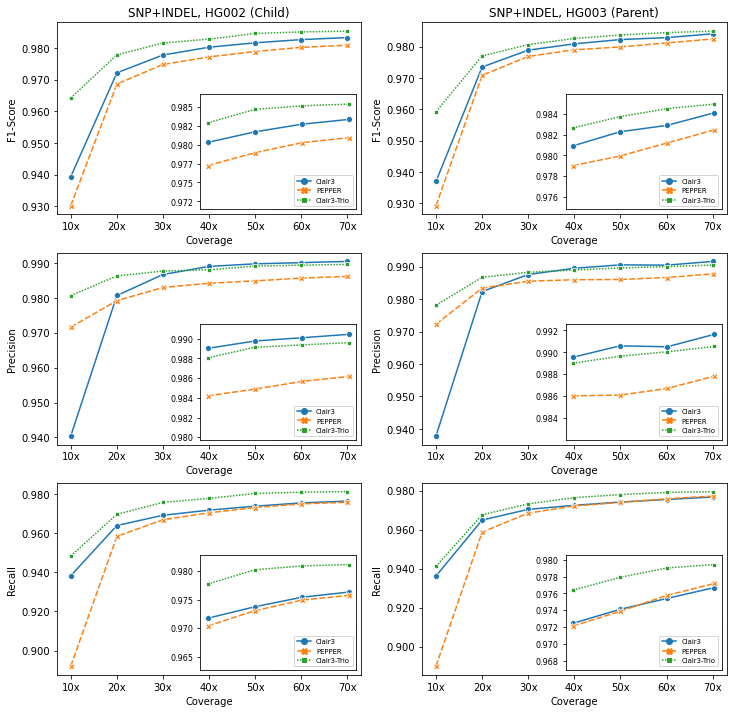
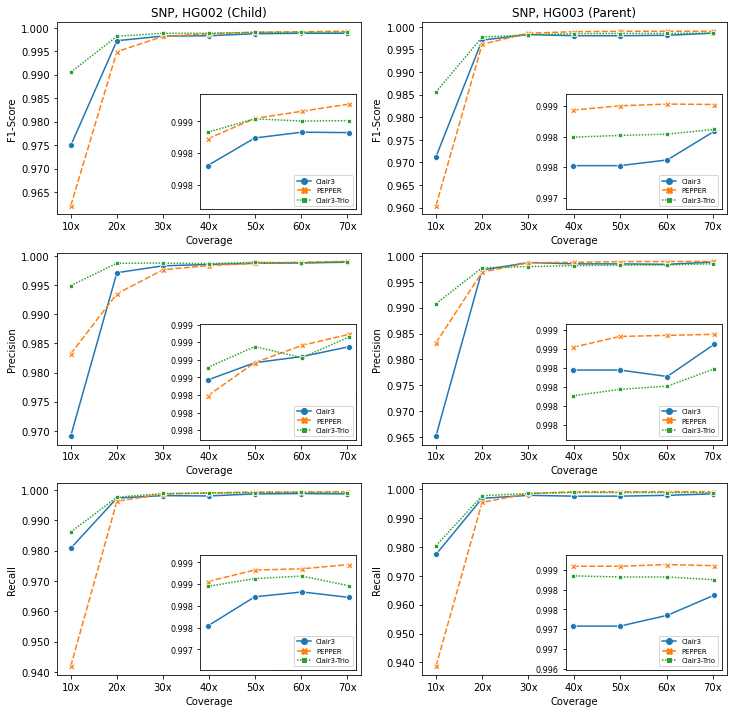
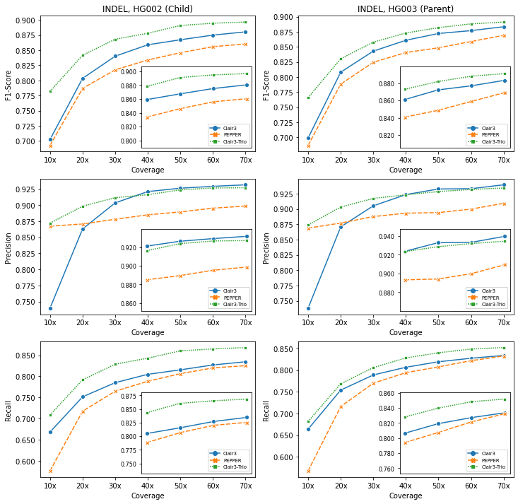
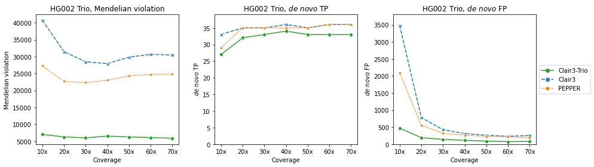

# Q20  data model

A model trained on R10.4 with the Kit 12 chemistry (Q20) data for Clair3-Trio

## Contents

* [How to use the Q20 model](#how-to-use-the-q20-model)
* [About `c3t_hg002_dna_r1041_e82_400bps_sup`](#about-q20)
* [Q20 data used for training and testing](#q20-data-used-for-training-and-testing)

---

## How to use the Q20 model

```
INPUT_DIR="[YOUR_INPUT_FOLDER]"            # e.g. /input
REF=${_INPUT_DIR}/ref.fa                   # change your reference file name here
OUTPUT_DIR="[YOUR_OUTPUT_FOLDER]"          # e.g. /output
THREADS="[MAXIMUM_THREADS]"                # e.g. 8
MODEL_C3="r1041_e82_400bps_sup_v400"         	# q20 Clair3 model
MODEL_C3T="c3t_hg002_dna_r1041_e82_400bps_sup"  # q20 Clair3-Trio model


docker run -it \
  -v ${INPUT_DIR}:${INPUT_DIR} \
  -v ${OUTPUT_DIR}:${OUTPUT_DIR} \
  hkubal/clair3-trio:latest \
  /opt/bin/run_clair3_trio.sh \
  --ref_fn=${INPUT_DIR}/ref.fa \                  ## change your reference file name here
  --bam_fn_c=${INPUT_DIR}/child_input.bam \       ## change your child's bam file name here 
  --bam_fn_p1=${INPUT_DIR}/parent1_input.bam \    ## change your parnet-1's bam file name here     
  --bam_fn_p2=${INPUT_DIR}/parent2_input.bam \   ## change your parnet-2's bam file name here   
  --sample_name_c=${SAMPLE_C} \                   ## change your child's name here
  --sample_name_p1=${SAMPLE_P1} \                 ## change your parnet-1's name here
  --sample_name_p2=${SAMPLE_P2} \                 ## change your parent-2's name here
  --threads=${THREADS} \                          ## maximum threads to be used
  --model_path_clair3="/opt/models/clair3_models/${MODEL_C3}" \
  --model_path_clair3_trio="/opt/models/clair3_trio_models/${MODEL_C3T}" \
  --output=${OUTPUT_DIR}                          ## absolute output path prefix 
```

Check [Usage](https://github.com/HKU-BAL/Clair3-Trio#Usage) for more options.

---

## About Q20

The Q20 model are trained on data obtained from [ONT](https://labs.epi2me.io/askenazi-kit14-2022-12/) (basecalled three GIAB samples (HG002, 3, 4) with fast5 available using dorado and the r1041_e82_400bps_sup_v400 config mode).

We trained the model while holding out chromosome 20 in training stages and preserving it for testing.

We compared the new model trained gainst [Clair3 v1.0, r1041_e82_400bps_sup_v400](https://github.com/HKU-BAL/Clair3) and [PEPPER r0.8, ont_r10_q20](https://github.com/kishwarshafin/pepper). 



---


---



---




---

All testing output are available at [here](http://www.bio8.cs.hku.hk/clair3_trio/analysis_result/6_r10_results/) and analysis results are in [this table](./r10_results.csv).

---


## Q20 data used for training and testing

### FASTQs and BAMs
[download data from here](https://labs.epi2me.io/askenazi-kit14-2022-12/)

### FAST5s
| Sample |   Reference   | Aligner  | Coverage |                   Basecaller                   |
| :----: | :-----------: | :------: | :------: | :--------------------------------------------: | 
| HG002  | GRCh38_no_alt | minimap2 |  70.13  | dorado | 
| HG003  | GRCh38_no_alt | minimap2 |  79.66   | dorado | 
| HG004  | GRCh38_no_alt | minimap2 |   64.72   | dorado | 

We trained the model while holding out chromosome 20 in training stages and preserving it for testing.

